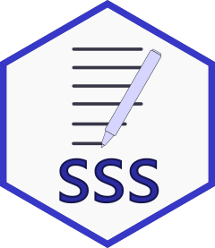

<!-- README.md is generated from README.Rmd. Please edit that file -->

# sss 

<!-- badges: start -->

[](https://github.com/andrie/sss/actions)
[](https://www.tidyverse.org/lifecycle/#stable)
[](https://codecov.io/gh/andrie/sss)
[](https://CRAN.R-project.org/package=sss)
[](http://www.r-pkg.org/pkg/secret)

<!-- badges: end -->

The `sss` package provides functions to import triple-s `XML` files into
R. The package supports sss files in both `.asc` and `.csv` format.

## Installation

You can install the released version of sss from
[CRAN](https://CRAN.R-project.org) with:

``` r
install.packages("sss")
```

And the development version from [GitHub](https://github.com/) with:

``` r
# install.packages("remotes")
remotes::install_github("andrie/sss")
```

## System dependencies

A previous version of this package imported the `XML` package, but from
version 0.1 the package imports `xml2`. The `xml2` package depends on
the `libxml2` library. If you run your code on linux, you may have to
manually install `libxml2`:

  - `libxml2-dev` (Debian, Ubuntu)
  - `libxml2-devel` (Red Hat, CentOS, Fedora)

## The triple-s standard

[triple-s](http://www.triple-s.org/) is a standard to transfer survey
data between applications.

## Example

This is a basic example which shows you how to solve a common problem:

``` r
library(sss)
## basic example code
```
